## 構成図

### Mermaid

```mermaid
graph LR
    Users[Users] -->|アクセス| FrontHosting1[Cloud Load Balancing]
    Users -->|アクセス| FrontHosting2[Cloud Load Balancing]
    SecurityMonitoring[Security Monitoring] -->|監視| StagingEnvironment
    SecurityMonitoring -->|監視| ProductionEnvironment
    AppStaging -->|自然言語処理| ChatGPT[ChatGPT]
    AppProduction -->|自然言語処理| ChatGPT

    subgraph developmentEnvironment
        subgraph Developers
            Members[Members]
            Managers[Managers]
        end
        Terraform
        GitHub
        GithubActions

        Developers[Developers] -->|コード変更| GitHub[GitHub]
        Developers -->|インフラコード更新| Terraform[Terraform]

        GitHub -->|CI/CD| GithubActions[GitHub Actions]
        GithubActions -->|インフラ構築| Terraform
    end

    GithubActions -->|自動デプロイ| StagingEnvironment
    GithubActions -->|リリース承認後デプロイ| ProductionEnvironment

    subgraph ExternalServices
        ChatGPT
        subgraph MeetingApps
            Zoom[Zoom]
            GoogleMeet[Google Meet]
            Teams[Teams]
        end
    end

    subgraph Staging Project
        subgraph StagingEnvironment
            AppStaging[Cloud Run]
            IAM1[Cloud IAM] -->|認証認可| AppStaging
            IAM1 -->|認証認可| SecretManagerStaging[Secret Manager]
            WAF1[Cloud Armor] -->|攻撃保護| FrontHosting1
            FrontHosting1 -->|トラフィックルーティング| AppStaging
            AppStaging -->|データ操作| DBStaging[Cloud SQL]
            subgraph DBStaging
                MainDBStaging[Cloud SQL Master]
                ReplicaDBStaging[Cloud SQL Replica]
            end
            AppStaging -->|データ操作| Storage1[Cloud Storage]
            AppStaging -->|機密情報取得| SecretManagerStaging
            TranscriptionServiceStaging[Vertex AI] -->|文字起こし| Storage1
        end
        LoggingStaging[Cloud Logging] -->|ログ収集| StagingEnvironment
        subgraph Staging Bot Integration
            MeetingBotStaging -->|文字起こし| TranscriptionServiceStaging[Vertex AI]
        end
        AppStaging -->|ミーティングデータ収集| MeetingBotStaging
    end

    subgraph Production Project
        subgraph ProductionEnvironment
            AppProduction[Cloud Run]
            IAM2[Cloud IAM] -->|認証認可| AppProduction
            IAM2 -->|認証認可| SecretManagerProduction[Secret Manager]
            WAF2[Cloud Armor] -->|攻撃保護| FrontHosting2
            FrontHosting2 -->|トラフィックルーティング| AppProduction
            AppProduction -->|データ操作| DBProduction[Cloud SQL]
            subgraph DBProduction
                MainDBProduction[Cloud SQL Master]
                ReplicaDBProduction[Cloud SQL Replica]
            end
            AppProduction -->|データ操作| Storage2[Cloud Storage]
            AppProduction -->|機密情報取得| SecretManagerProduction
            TranscriptionServiceProduction[Vertex AI] -->|文字起こし| Storage2
        end
        LoggingProduction[Cloud Logging] -->|ログ収集| ProductionEnvironment
        subgraph Production Bot Integration
            MeetingBotProduction -->|文字起こし| TranscriptionServiceProduction[Vertex AI]
        end
        AppProduction -->|ミーティングデータ収集| MeetingBotProduction
    end

    MeetingBotStaging -->|連携| MeetingApps
    MeetingBotProduction -->|連携| MeetingApps

    subgraph MLOps
        AIPlatformPipelines -->|トレーニングパイプライン| ModelRegistry
        AIPlatformPipelines[AI Platform Pipelines] -->|CI/CD| GithubActions
        ModelRegistry[Model Registry] -->|モデルデプロイ| TranscriptionServiceStaging
        ModelRegistry -->|モデルデプロイ| TranscriptionServiceProduction
        ModelRegistry -->|バージョン管理| Terraform
        ModelEvaluation[Model Evaluation] -->|評価| AIPlatformPipelines
        Terraform -->|モデル更新| AIPlatformPipelines
    end

    subgraph LoggingAndMonitoring
        LoggingStaging -->|ログ転送| LoggingSink
        LoggingProduction -->|ログ転送| LoggingSink
        LoggingSink -->|ログエクスポート| BigQuery[BigQuery]
        LoggingSink -->|ログエクスポート| CloudStorage[Cloud Storage]
        LoggingSink -->|ログ通知| PubSub[Pub/Sub]
        PubSub -->|通知| Slack[Slack]
        BigQuery -->|ログ分析| DataStudio[Data Studio]
        Monitoring[Cloud Monitoring] -->|メトリクス収集| StagingEnvironment
        Monitoring -->|メトリクス収集| ProductionEnvironment
        Monitoring -->|アラート通知| Slack
        Monitoring -->|ダッシュボード| GrafanaHosting[Grafana Hosting]
    end

    classDef environment fill:#efe,color:#092,stroke:none
    classDef service fill:#ffd,color:#420,stroke:none
    classDef database fill:#dff,color:#204,stroke:none
    classDef integration fill:#fdd,color:#811,stroke:none
    classDef cicd fill:#fdf,color:#318,stroke:none
    classDef monitoring fill:#eef,color:#119,stroke:none
    classDef logging fill:#ffe,color:#841,stroke:none

    subgraph Legend
        environment(environment: 開発、ステージング、本番環境を表すコンポーネント)
        service(service: 各種サービスを表すコンポーネント)
        database(database: データベースを表すコンポーネント)
        integration(integration: 外部サービスとの連携を表すコンポーネント)
        cicd(cicd: CI/CDに関連するコンポーネント)
        monitoring(monitoring: 監視に関連するコンポーネント)
        logging(logging: ロギングに関連するコンポーネント)
    end

    class developmentEnvironment,Staging,Production,StagingEnvironment,ProductionEnvironment,environment environment
    class Users,FrontHosting1,FrontHosting2,SecurityMonitoring,ChatGPT,Zoom,GoogleMeet,Teams,AppStaging,AppProduction,WAF1,WAF2,IAM1,IAM2,SecretManagerStaging,SecretManagerProduction,Storage1,Storage2,CloudStorage,TranscriptionServiceStaging,TranscriptionServiceProduction,service service
    class DBStaging,DBProduction,MainDBStaging,ReplicaDBStaging,MainDBProduction,ReplicaDBProduction,database database
    class MeetingApps,StagingBotIntegration,ProductionBotIntegration,MeetingBotStaging,MeetingBotProduction,integration integration
    class GitHub,GithubActions,Terraform,AIPlatformPipelines,ModelRegistry,ModelEvaluation,cicd cicd
    class Monitoring,DataStudio,GrafanaHosting,monitoring monitoring
    class LoggingStaging,LoggingProduction,LoggingSink,BigQuery,PubSub,Slack,logging logging
```



## オペレーション

### Terraform

#### ディレクトリ構成

```plaintext
terraform
├── README.md
├── environments
│   ├── dev
│   │   ├── main.tf
│   │   ├── outputs.tf
│   │   ├── terraform.tfvars.template
│   │   └── variables.tf
│   └── prod
│       ├── main.tf
│       ├── outputs.tf
│       ├── terraform.tfvars.template
│       └── variables.tf
└── modules
    └── azure
        ├── database
        │   ├── main.tf
        │   ├── outputs.tf
        │   └── variables.tf
        ├── resource_group
        │   ├── main.tf
        │   ├── outputs.tf
        │   └── variables.tf
        ├── static_site
        │   ├── main.tf
        │   ├── outputs.tf
        │   └── variables.tf
        └── storage
            ├── main.tf
            ├── outputs.tf
            └── variables.tf

```

#### コマンド

```bash
# プロジェクト初期化
terraform init

# プラン確認
terraform plan

# デプロイ
terraform apply

# 破棄
terraform destroy
```

### Github secrets

#### `AZURE_STATIC_WEB_APPS_API_TOKEN_{env}`

```bash
az staticwebapp secrets list --name {static_site_name} --query properties.apiKey
```

<!-- TODO: 開発と本番で分ける -->

#### `AZURE_CLIENT_SECRET_{env}`

`az ad sp list`コマンドの出力結果の id が client_id となる

```bash
az ad sp list --display-name "discket-{env}-app"

az ad sp credential reset --id {client_id}
```

上記で出力される`password`を GitHub の Secrets に登録する。

#### `AZURE_SUBSCRIPTION_ID`

```bash
az account show --query id -o tsv
```

#### `AZURE_TENANT_ID`

```bash
az account show --query tenantId -o tsv
```

#### `AZURE_CLIENT_ID_{env}`

```bash
az ad sp show --id {client_id} --query appId -o tsv
```

を実行して、API キーを取得し、GitHub の Secrets に登録する。

#### `AZURE_FUNCTIONAPP_PUBLISH_PROFILE_{env}`

portal から取得、以下を参照。
https://learn.microsoft.com/en-us/visualstudio/azure/how-to-get-publish-profile-from-azure-app-service?view=vs-2022

## create machine learning model

```bash
az ml online-endpoint create --name whisper --file endpoints/online/whisperx/endpoint.yaml -w "discketmldev" -g "discket_dev_rg"
```

```bash
az ml online-deployment create --file azure/endpoints/online/whisperx/MLmodel.yaml -w "discketmldev" -g "discket_dev_rg" --all-traffic --set properties.timeout=2400
```
